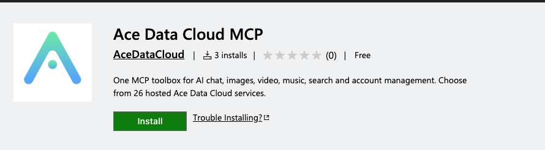
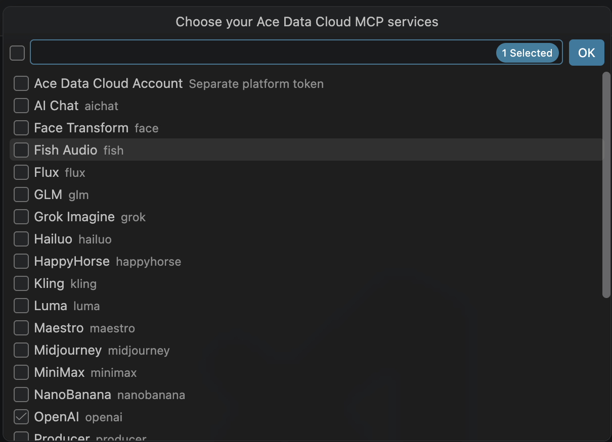
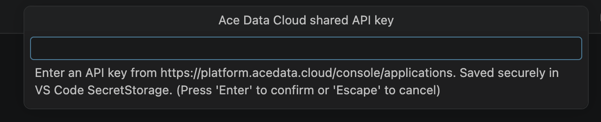
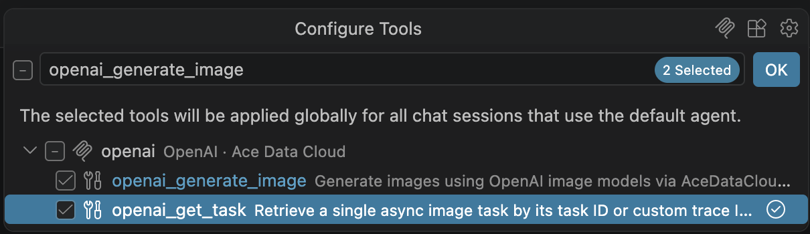
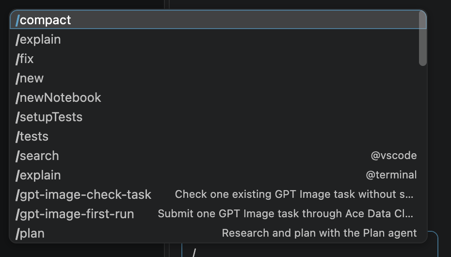
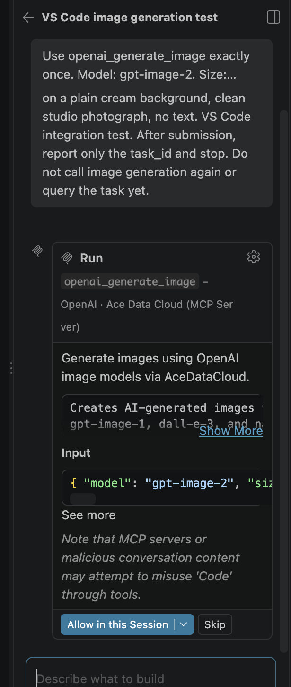
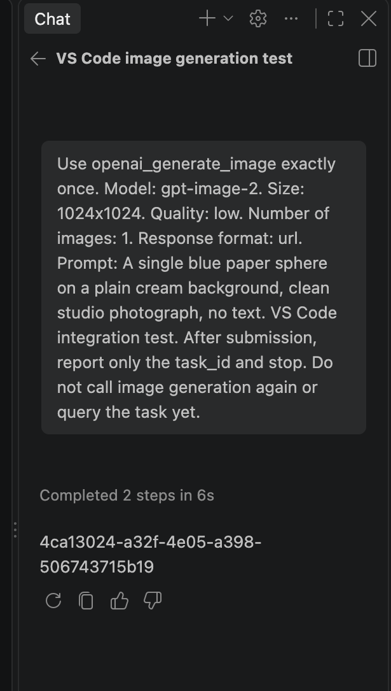
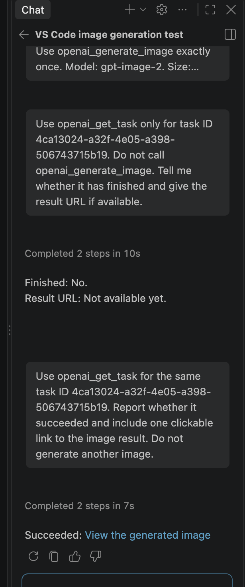

# Ace Data Cloud MCP：VS Code 手把手教程

一个扩展可接入 26 个托管 MCP 服务，包括图片、视频、音乐、搜索和账号管理。按需选择服务，无需安装 Python 或运行本地 MCP 进程。[English guide](README.md) · [模型与实时价格](https://platform.acedata.cloud/models)

## 第一次生成图片：在 VS Code 使用 GPT Image

本例只提交 **一次**低画质 `gpt-image-2` 生成，然后用**同一个任务 ID** 查询到图片完成。截图来自真实的英文版 VS Code 1.141；你的模型、任务 ID、图片地址和 Credits 费用会不同。

### 1. 从官方市场安装

打开官方 VS Code Marketplace 的 [Ace Data Cloud MCP](https://marketplace.visualstudio.com/items?itemName=acedatacloud.mcp-toolbox)，确认发布者为 **AceDataCloud / acedatacloud**，点击 **Install**；若 VS Code 提示，完成重载。需要 VS Code 1.101 及以上版本和支持工具调用的 Agent 聊天模型。



### 2. 获取正确的 API Key

1. 登录 [Ace Data Cloud → Applications](https://platform.acedata.cloud/console/applications)。
2. 打开 **General application**，复制其 API Key；也可以选择 **Manage Keys → Create** 为 VS Code 单独创建。提交任务前确认 OpenAI 图片生成权限、当前价格和余额。
3. 如果启用了 **Allowed APIs**，生成和查任务两个接口都需要允许：`/openai/images/generations`、`/openai/tasks`。只复制 Token 本身，不要加 `Bearer ` 或引号。`platform-...` 平台管理 Token 用于可选的账号 MCP，不是此图片工具的 Key。


### 3. 选择 GPT Image 工具并授权

打开命令面板，运行 **Ace Data Cloud: Choose MCP Services**。GPT Image 位于 **OpenAI** 服务中，它提供 `openai_generate_image` 和 `openai_get_task`。第一次运行只选 OpenAI，取消其他服务，再点 **OK**。**Ace Data Cloud Account** 需要另一种平台 Token，本例不使用。



运行 **Ace Data Cloud: Set Shared API Key**，粘贴应用 API Key。扩展把 Key 保存在 VS Code SecretStorage，不会写入工作区。如果希望 OpenAI 服务单独使用受限 Key，可运行 **Set Service API Key**。若 VS Code 请求信任 MCP 服务器，先确认目标为 `https://openai.mcp.acedata.cloud/mcp` 再接受。



### 4. 只启用所需的两个工具

打开 **Chat → Agent**，选择支持工具调用的模型。可以使用独立的 [Ace Data Cloud Chat Models 扩展](https://github.com/AceDataCloud/VSCodeModelProvider)，也可以使用其他兼容模型。在 Chat 中点击 **Configure Tools**；若 **OpenAI · Ace Data Cloud** 下没有工具，先点 **Update Tools**，再启用 `openai_generate_image` 和 `openai_get_task`。本例可关闭无关工具。



### 5. 只提交一次生成

把下面提示词粘贴到 Chat；也可以把[无密钥生成提示词](examples/gpt-image-first-run.prompt.md)复制到工作区 `.github/prompts/` 目录后从 Chat 运行。



```text
Use openai_generate_image exactly once. Model: gpt-image-2. Size: 1024x1024. Quality: low. Number of images: 1. Response format: url. Prompt: A single blue paper sphere on a plain cream background, clean studio photograph, no text. VS Code integration test. After submission, report only the task_id and stop. Do not call image generation again or query the task yet.
```

点击 **Allow in this Session** 前，核对工具参数：`model=gpt-image-2`、`size=1024x1024`、`quality=low`、`n=1`、`response_format=url`。接收成功会返回 `task_id`，**不代表图片已经完成**。保存这个 ID；不要重跑生成来查看进度。





### 6. 只查询这个任务，直到完成

在 **Configure Tools** 中关闭 `openai_generate_image`，只留下 `openai_get_task`。把[无密钥查询提示词](examples/gpt-image-check-task.prompt.md)中的 `TASK_ID` 换成上一步的 ID，或在 Chat 粘贴：

```text
Use openai_get_task only for task ID TASK_ID. Do not call openai_generate_image. Tell me whether it has finished and give one clickable link to the image result if available.
```

若尚无 `finished_at` 或结果地址，等待后再次查询**同一个 ID**。只有响应包含 `finished_at` 且 `response.success=true` 才算完成；绿色 Chat 回合或任务被接收都不足以证明生成成功。



### 7. 打开图片并核对账单

点击 **View the generated image**。我们的实测链接返回 HTTP 200、1024 × 1024 PNG。到 [Ace Data Cloud Usage](https://platform.acedata.cloud/console/usage) 用**唯一生成任务 ID**核对 Credits；查询任务不应再次产生图片生成费用。价格和套餐换算率会变化，请查看当前显示，而不要照搬示例金额。

| 现象 | 处理方式 |
| --- | --- |
| 401 或 403 | 检查应用 Key、服务权限、有效期、Allowed APIs 和余额；不要用平台管理 Token。 |
| 参数错误 / 400 | 复制上面准确的模型、画质、尺寸和数量。 |
| 仍在运行或没有地址 | 再查同一个任务 ID，不要为轮询重新提交生成。 |
| 429 | 等待并降低并发；不要开启自动付费重试。 |
| 5xx、超时或任务失败 | 决定是否重新付费提交前，先检查原任务和用量历史；联系支持时提供任务/Trace ID，不要提供 Key。 |

## 其他服务

同一个扩展还提供[英文 README 的完整服务清单](README.md#services)。**GPT Image 对应 OpenAI**，**Google Search 对应 Google Search**（内部 ID 为 `serp`）。每个服务有独立工具；选择服务后先确认 API 权限和当前价格，执行写操作前核对确认框。可用 **Set Service API Key** 为某个服务存单独的 Key。若同时安装了对应的独立 MCP 扩展，应禁用重复入口，避免工具列表出现两份。

扩展只向选中的 Ace Data Cloud MCP 服务器提供必要输入和 Key；VS Code 控制服务器何时启动。Key 存在 VS Code SecretStorage 中，不在可导出的提示词文件里。需要移除时运行 **Ace Data Cloud: Clear Saved Credentials**。费用按当前服务和账号套餐计算。
